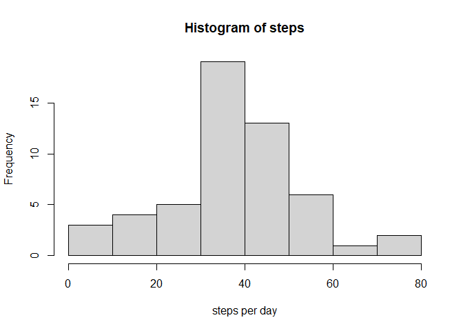
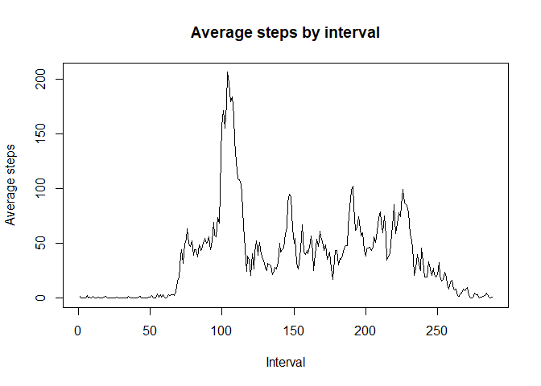
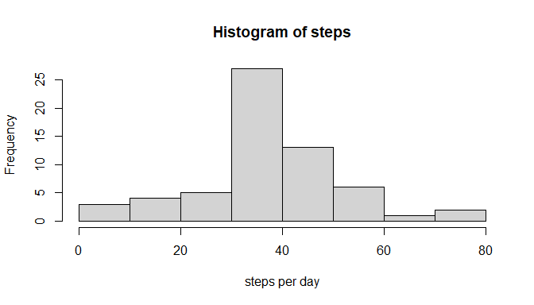
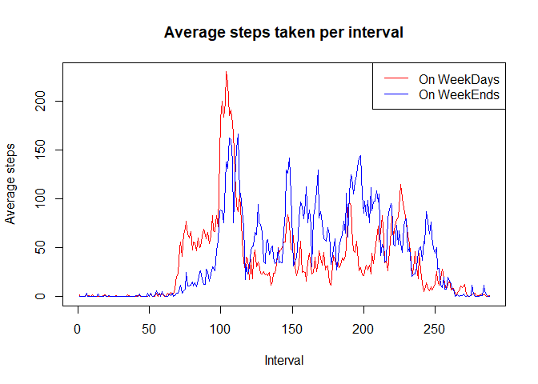

---
output:
  html_document: 
    keep_md: yes
  word_document: default
---
Reproducible Research: Course Project 1
==========================================

In this report, data from a personal activity monitoring devide will ne loaded, processed and analyzed in differents forms.


## Loading and preprocessing the data  

First of all, we need to load the data and make it tidy


```r
data <- read.csv("C:/Users/jesus/OneDrive/Documentos/data/activity.csv")
data$date <- as.Date(data$date)
```

And, take a look of the data


```r
summary(data)
```

```
##      steps             date               interval     
##  Min.   :  0.00   Min.   :2012-10-01   Min.   :   0.0  
##  1st Qu.:  0.00   1st Qu.:2012-10-16   1st Qu.: 588.8  
##  Median :  0.00   Median :2012-10-31   Median :1177.5  
##  Mean   : 37.38   Mean   :2012-10-31   Mean   :1177.5  
##  3rd Qu.: 12.00   3rd Qu.:2012-11-15   3rd Qu.:1766.2  
##  Max.   :806.00   Max.   :2012-11-30   Max.   :2355.0  
##  NA's   :2304
```

## Histogram of steps per day

Now, let's see an histogram of the total number of step taken each day


```r
hist(tapply(data$steps,data$date,mean), xlab= "steps per day", main= "Histogram of steps")
```

<!-- -->


## Mean and median of steps

The mean is, 


```r
mean <- mean(data$steps, na.rm = T)
mean
```

```
## [1] 37.3826
```

And, the median is,


```r
median <- median(data$steps, na.rm = T)
median
```

```
## [1] 0
```

### Plot of the average steps

Here's the average steps taken by each interval


```r
plot(tapply(data$steps,data$interval,mean, na.rm=T), xlab = "Interval", ylab = "Average steps", main = "Average steps by interval" ,type = "l")
```

<!-- -->

## Interval that contains the maximum number of steps

And the interval which has, on average, the maximum number of steps takes is calculated by


```r
x <- tapply(data$steps,data$interval,mean, na.rm=T)
max <-x[which.max(x)]
```

So, it seems that between 835 and 840 we have the maximum, on average, steps taken, which are 206 steps


## Imputing missing data

In this step, I'm imputing missing values for the mean in that interval


```r
library(dplyr)
imputed <- data %>% group_by(interval) %>% mutate(mean=mean(steps, na.rm=T))
data <- data %>% group_by(date) %>% mutate(imputed=ifelse(is.na(steps), yes= imputed$mean, no=steps))
```

All NAs were imputed, we can verifed that with the next formula


```r
sum(is.na(data$imputed))
```

```
## [1] 0
```

## Histogram of steps per day (updated with NAs imputed)

Here's a histogram of the steps taken per day, but now with no NAs


```r
hist(tapply(data$imputed,data$date,mean), xlab= "steps per day", main= "Histogram of steps")
```

<!-- -->

## Average steps per interval (weekdays vs weekends)

In this seccion, the steps taken per interval is compared between weekday and weekends


```r
weekdays <- c("Monday", "Tuesday", "Wednesday", "Thursday", "Friday")
data$wDay <- factor((weekdays(data$date) %in% weekdays), levels = c(F, T), labels = c("weekend","weekday"))
data$w <- paste(data$interval,data$wDay)
wday <- data[data$wDay=="weekday",]
wend <- data[data$wDay=="weekend",]
plot(tapply(wday$imputed,wday$interval, mean), type ="l", xlab = "Interval", ylab = "Average steps", main = "Average steps taken per interval", col = "red")
lines(tapply(wend$imputed,wend$interval, mean), type ="l", col = "blue")
legend("topright", legend = c("On WeekDays", "On WeekEnds"), col = c("red", "blue"), lty = 1)
```

<!-- -->


